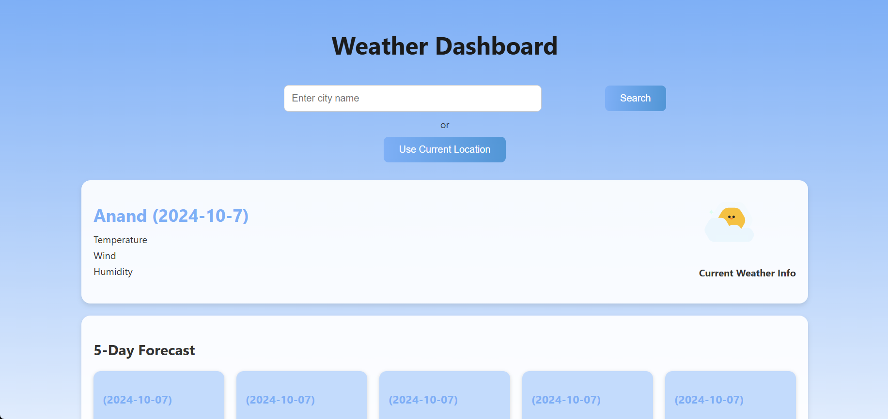
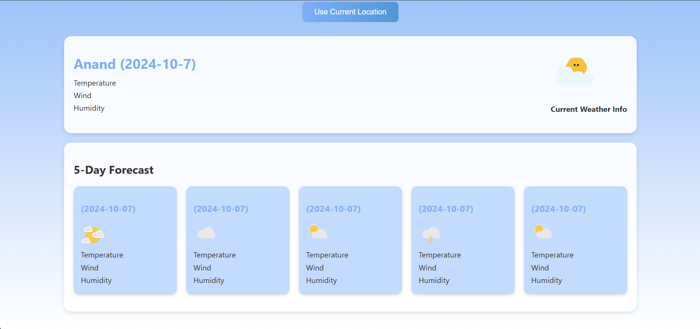

<!DOCTYPE html>
<html lang="en">
<head>
  <meta charset="UTF-8">
  <meta name="viewport" content="width=device-width, initial-scale=1.0">
  <title>Weather Dashboard - README</title>
</head>
<body>
  <h1>Weather Dashboard</h1>

  

    <h2>Overview</h2>
    

      The Weather Dashboard is a web application that allows users to search for weather information by city name or use their current location to get real-time weather data. The application provides current weather conditions and a 5-day weather forecast. It uses the OpenWeatherMap API to fetch weather data and GSAP for animations.
    

  

  

    <h2>Features</h2>
    <ul>
      <li><strong>Search by City Name</strong>: Users can enter a city name to get the current weather and 5-day forecast.</li>
      <li><strong>Current Location</strong>: Users can use their current location to get weather information.</li>
      <li><strong>Current Weather</strong>: Displays the current temperature, wind speed, humidity, and weather description.</li>
      <li><strong>5-Day Forecast</strong>: Provides a 5-day weather forecast with temperature, wind speed, and humidity.</li>
      <li><strong>Animations</strong>: Uses GSAP for smooth animations when loading the page.</li>
    </ul>
  

  

    <h2>Technologies Used</h2>
    <ul>
      <li><strong>HTML</strong>: Structure of the web page.</li>
      <li><strong>CSS</strong>: Styling and layout of the web page.</li>
      <li><strong>JavaScript</strong>: Logic for fetching and displaying weather data.</li>
      <li><strong>GSAP (GreenSock Animation Platform)</strong>: For animations.</li>
      <li><strong>OpenWeatherMap API</strong>: For fetching weather data.</li>
      <li><strong>DotLottie</strong>: For animated weather icons.</li>
    </ul>
  

  

    <h2>Installation</h2>
    <ol>
      <li>
        <strong>Clone the Repository</strong>:
        <pre><code>git clone https://github.com/your-username/weather-dashboard.git
cd weather-dashboard</code></pre>
      </li>
      <li>
        <strong>Open the Project</strong>:
        
Open the <code>index.html</code> file in your preferred web browser.

      </li>
      <li>
        <strong>API Key</strong>:
        
Replace the <code>API_key</code> variable in the <code>script.js</code> file with your own OpenWeatherMap API key.

        <pre><code>const API_key = "your_api_key_here";</code></pre>
      </li>
    </ol>
  

  

    <h2>Usage</h2>
    <ol>
      <li>
        <strong>Search by City Name</strong>:
        
Enter the city name in the input field and click the "Search" button.

      </li>
      <li>
        <strong>Use Current Location</strong>:
        
Click the "Use Current Location" button to get weather information based on your current location.

      </li>
      <li>
        <strong>View Weather Information</strong>:
        
The current weather and 5-day forecast will be displayed on the page.

      </li>
    </ol>
  

  

    <h2>Code Structure</h2>
    <ul>
      <li><code>index.html</code>: The main HTML file that contains the structure of the weather dashboard.</li>
      <li><code>styles.css</code>: Contains the CSS styles for the weather dashboard.</li>
      <li><code>script.js</code>: Contains the JavaScript logic for fetching and displaying weather data.</li>
    </ul>
  

  

    <h2>API Reference</h2>
    
<strong>OpenWeatherMap API</strong>: Used to fetch weather data.

    
<a href="https://openweathermap.org/api" target="_blank">OpenWeatherMap API Documentation</a>

  

  

    <h2>Contributing</h2>
    
Contributions are welcome! Please follow these steps:

    <ol>
      <li>Fork the repository.</li>
      <li>Create a new branch (<code>git checkout -b feature-branch</code>).</li>
      <li>Commit your changes (<code>git commit -m 'Add some feature'</code>).</li>
      <li>Push to the branch (<code>git push origin feature-branch</code>).</li>
      <li>Open a pull request.</li>
    </ol>
  

  

    <h2>License</h2>
    
This project is licensed under the MIT License - see the <a href="LICENSE">LICENSE</a> file for details.

  

  

    <h2>Acknowledgments</h2>
    <ul>
      <li><a href="https://openweathermap.org/" target="_blank">OpenWeatherMap</a> for providing the weather data API.</li>
      <li><a href="https://greensock.com/gsap/" target="_blank">GSAP</a> for the animation library.</li>
      <li><a href="https://dotlottie.io/" target="_blank">DotLottie</a> for the animated weather icons.</li>
    </ul>
  

  

    <h2>Screenshots</h2>
    

    

  

  

    <h2>Live Demo</h2>
    
<a href="https://bhavu7.github.io/Weather-Dashboard/" target="_blank">Live Demo</a>

  

  

    
Feel free to explore the code and contribute to the project. If you have any questions or suggestions, please open an issue or contact the maintainers.

    
Happy Coding! 🌦️

  

</body>
</html>
